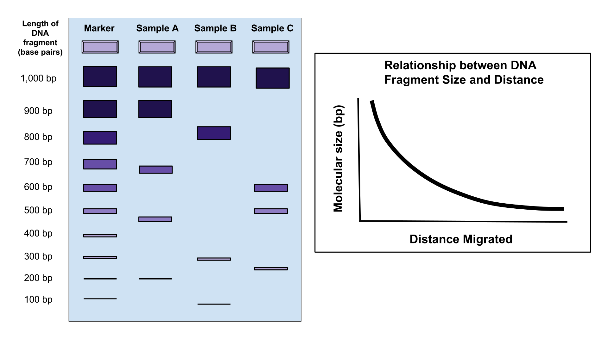
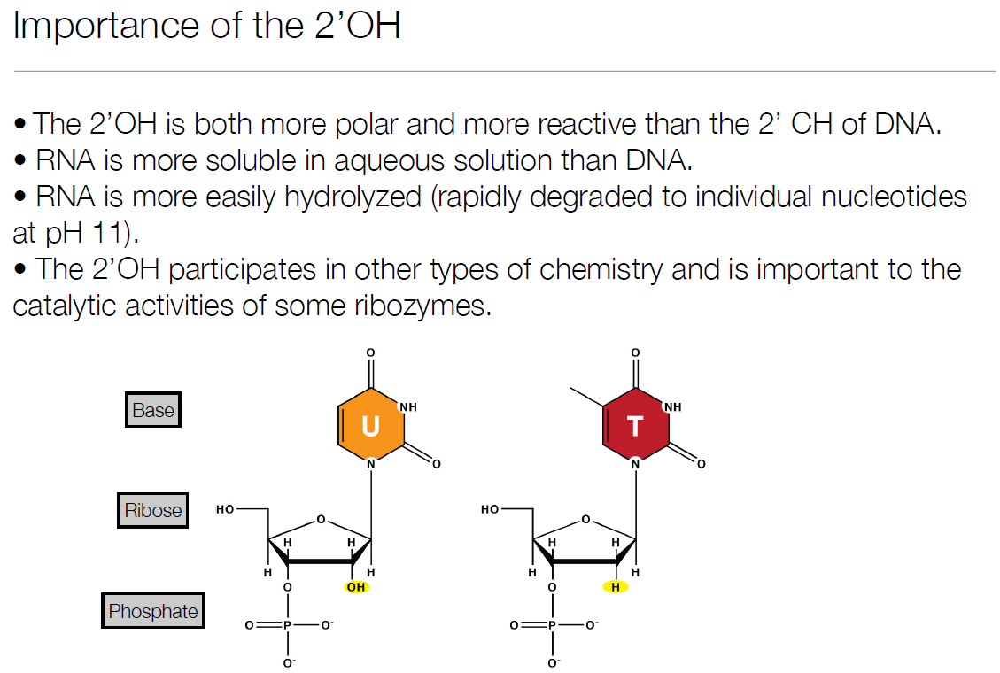
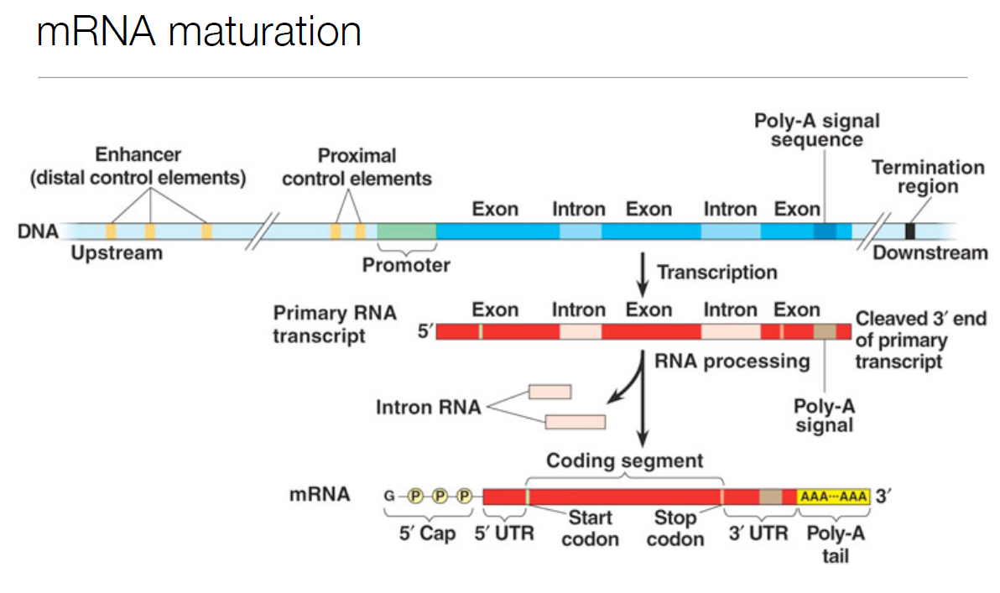
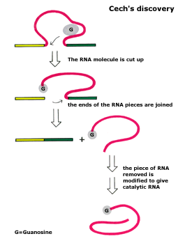
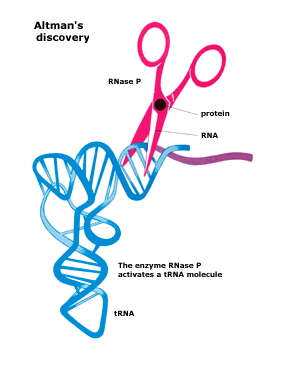
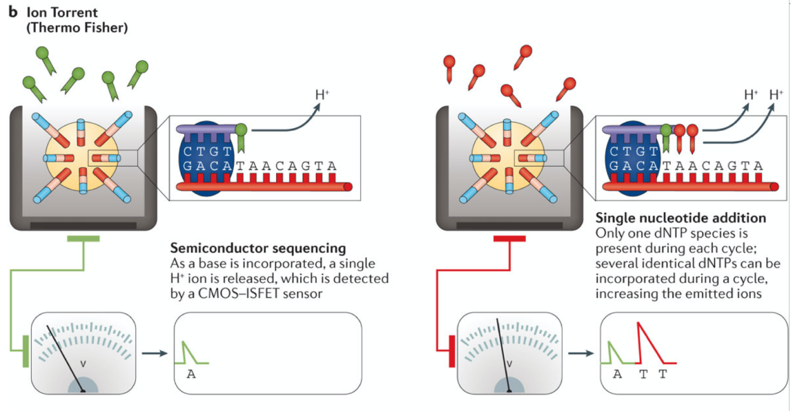
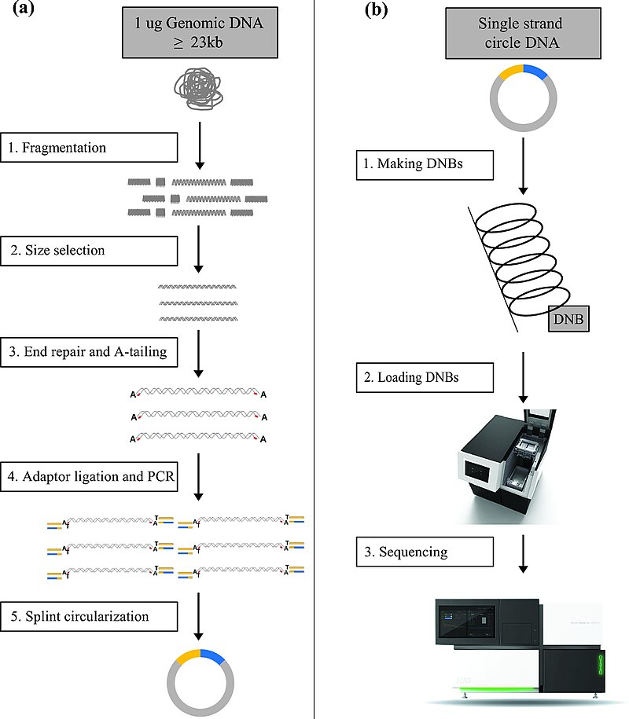

# Bi622  
### 07/19/2021
### Genomics History

1) Timeline:
```
 1859 - how are traits inherited?
 1865 - Whatt is the chemica nature of genetic traits?
 1950 - How is information encoded in DNA?
 1970 - What information is contained in a genome and how does it all work?
```
2) 1871 - J.F. Miescher - reports the first chemical composition of DNA
3) 1890’s- Albrecht Kossel demonstrates that DNA is composed of 4 nucleotides
4) 1900 - Walter Sutton and Theodor Heinrich Boveri -Chromosomes and Inheritance
5) 1905 - Nettie Stevens and Edmund Wilson -Chromosomal basis of sex determination
6) 1918 - Ronald Fisher- Eugenicist who did some stats stuff
7) 1920-30’s - Thomas Morgan - the fly guy (gene linkage)
8) 1928 - Frederick Griffith - Bacteria can be transformed by material extracted from heat killed bacteria
9) 1944 Oswald Avery and colleagues -The transforming material is DNA
10) 1952 Alfred Hershey and Martha Chase -Viral genes are made of DNA
11) 1953 Watson and Crick stole X-ray crystallography data to demonstrate that DNA forms a double helix

 > ###### Rosalind Franklin and Maurice Wilkins performed the x-ray experiments

12) 1961 - Sydney Brenner and Leslie Barnett

```
Codons are a multiple of 3
• They are non-overlapping
• They start from a fixed point
• They are contiguous (no interruptions)
• The code is probably degenerate
```
13) 1960’s - Two groups, lead by Khorana nd Nirenberg deciphered the complete genetic code.
14) 1972 - Stanley Cohen and Herbert Boyer invented cloning using plasmids and restriction enzymes.
15) 1972 Stanley Cohen and Herbert Boyer invented cloning using plasmids and restriction enzymes.
16) 1984 Kary Mullis invents PCR at Cetus Corp.
17) 1990 - Human Genome Project begins.
18) 1995 Craig Venter and colleagues sequence the 1st genome of a free living organism.
19) 1997 the genome of S. cerevisiae is published
20) 1998 the genome of C. elegans is published
21) 2003 Release of complete human genome

---
### Sanger Sequencing





> ##### Sequencing by termination

---
### 07/20/2021
### 


#

#

<p align="center">


#
</p>

<p align="center">

</p>

#
### 07/22/2021
  
</br>  

### Overview of Sequencing Platforms

</br>

1) Southern blotting:  
</t> a) 1st method to detect specific DNA seq  
</t> b) After gel electrophoresis DNA is transferred to nitrocellulose  

2) Microarrays:  
</t> a) Probes attached to glass or plastic  
</t> b) Nucleic acid sample is labelled with a flourecent molecule  
</t> c) Relies on perfect complimentary base pairing to detect target sequence  

3) NGS:  
</t> a) High throughput and unbiased compared to microarrays  
</t> b) Most require amplification (PCR errors)  
</t> c) Most common methods use short read sequencing  

4) Roche:  
</t> a) Out of commission  
</t> b) Uses pyrosequencing  

5) Semiconductor sequencing (Ion Torrent):  


#

6) Oxford Nanopore:  
</t> a) Measures changes in current

7) MGI:  
</t> a) DNA nanoballs


#


8) Illumina:  
</t> a) Sequencing by synthesis

